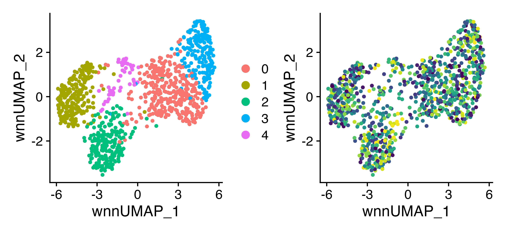

# Summary

B cells are critical for adaptive immunity and are governed by the recognition of an antigen by the B cell receptor (BCR), a process that drives a coordinated series of signaling events and modulation of various transcriptional programs. Single-cell RNA sequencing with paired BCR profiling could offer insights into numerous physiological and pathological processes. However, unlike the plethora of single-cell RNA analysis pipelines, computational tools that utilize single-cell BCR sequences for further analyses are not yet well developed. Here we report Ibex, which vectorizes the amino acid sequence of the complementarity-determining region 3 (CDR3) of the immunoglobulin heavy and light chains, allowing for unbiased dimensional reduction of B cells using their BCR repertoire. Ibex is implemented as an R package with integration into both the Seurat and Single-Cell Experiment framework, enabling the incorporation of this new analytic tool into many single-cell sequencing analytic workflows and multimodal experiments.


{width="30%"}


# Statement of need

Single-cell sequencing has become a mainstay in immunology. In addition to enabling the characterization of various immune populations and their transcriptional profiles, single-cell sequencing technologies allow for the pairing of transcriptomic and clonotypic data providing insight into the complexities of the adaptive immune response. In the context of lymphocytes, the immune response is regulated by antigen recognition at the site of the adaptive immune receptor. In B cells, somatic recombination genes determine the BCR sequence at heavy and light chain loci [@schatz_recombination_2011] and in the germinal center via somatic hypermutation [@odegard_targeting_2006]. This process collectively produces groups of “clonal lineages” sequences that are generally used as categorical data in single-cell analysis. 

Several tools have been put forth to integrate single-cell transcriptomic and T-cell receptor sequences, such as `CoNGA` [@schattgen_integrating_2022], `TESSA` [@zhang_mapping_2021], and `mvTCR` [@drost_integrating_2022]. The latter two tools leverage neural networks to generate a latent representation of the CDR3 sequence. The power of this approach has been shown in cancer detection [@beshnova_novo_2020] and in predicting responses to immunotherapy [@sidhom_deep_2022]. Recent deep-learning approaches have shown promise in optimizing antibody selection (Mason et al., 2021). Other groups propose the potential of using natural language processing to better understand the linguistics of immunoglobulins (Ig) and improve *in silico* development [@vu_immunolingo_2022; @ostrovsky-berman_immune2vec_2021]. However, except the recent Benisse python package [@zhang_interpreting_2022], tools for integrating multimodal single-cell sequencing data with BCR sequences are lacking and nonexistent for the R environment.

Using deep autoencoder models, we developed an intuitive tool to encode single-cell BCR light and heavy chain sequences. For each chain, the CDR3 sequence is directly converted to a format for one-hot autoencoding or first converted into an amino acid property matrix, such as Atchley factors [@atchley_solving_2005] or Kidera factors [@kidera_statistical_1985]. This latter conversion has been applied to TCR strategies, such in motif-based repertoire profiling via support vector machines [@thomas_tracking_2014]. The respective chain- and approach-specific model is then applied to the resulting transformation to produce encoded numerical vectors. With the Ibex package, the encoded numerical vectors can be incorporated into single-cell objects and used directly for dimensional reduction or multimodal integration. This provides an uncomplicated and adaptable approach for the incorporation of BCR sequences to the analysis of single-cell B-cell data. In addition, Ibex is compatible with our previous `scRepertoire` R package [@borcherding_screpertoire_2020], enabling users to easily attach adaptive immune receptor sequences to single-cell objects. 


# Underlying Models and Training

Ibex offers a total of 16 autoencoder models split by 1) the model architecture: classical autoencoder and variational autoencoder, 2) the chains to encode: heavy or light, and 3) the input to the model: one-hot encoding or CDR3 sequences translated in Atchley factors, Kidera factors, or both Atchley and Kidera factors combines. Each available autoencoder was trained on 1,500,000 productive human CDR3 sequences of the respective Ig chain. To provide for more robust models, training and testing data cohorts were collected across a range of disease processes, including infection, autoimmunity, malignancy, and healthy controls. Sequence length for heavy (mean = 16.79, median = 16.00, sd = 3.69) and light chain (mean = 11.92, median = 12.00, sd =1.41). The encoder used a 256-128-30-128-256 neuron structure in the keras R package (v2.4.0). A range of hyperparameters were evaluated and the following were selected: batch size of 64, learning rate of 0.00001, and latent dimensions of 30. The optimization utilized a stochastic gradient descent approach known as Adam for the amino acid property-based autoencoders.  Each autoencoding training involved zero padding up to 70 residues to allow for variable CDR3 lengths. In addition, each model was trained using an 80:20 data split and had early stopping monitoring for minimal value loss and patience of 10 epochs.


# Minimal Example

To install ``Ibex`` use:

```r
devtools::install_github("ncborcherding/Ibex")
```

Using Ibex, we can investigate single-cell data to combine gene expression, protein quantifications, and BCR sequences into a single representation. To demonstrate the application of Ibex, we investigated single-cell peripheral blood B cells in COVID-19-associated multisystem inflammatory syndrome [@ramaswamy_immune_2021]. 

```r
library(Ibex)
library(Seurat)
library(ggplot2)
library(patchwork)

#Loading the example data
SeuratObj <- readRDS(url("https://www.borch.dev/uploads/data/Ibex_FullExample.rds"))

#Running Ibex on the Heavy Chain
SeuratObj <- runIbex(SeuratObj, 
                     chains = "Heavy",
                     encoder.input = "KF", 
                     reduction.name = "ibex.KF")

#Combining RNA, Protein, and Ibex vectors with WNN                  
SeuratObj <- FindMultiModalNeighbors(
                    SeuratObj, 
                    reduction.list = list("pca", "apca", "ibex.KF"), 
                    dims.list = list(1:30, 1:20, 1:30), 
                    modality.weight.name = "RNA.weight")

#Dimensional Reduction for WNN
SeuratObj <- RunUMAP(SeuratObj, 
                     nn.name = "weighted.nn", 
                     reduction.name = "wnn.umap", 
                     reduction.key = "wnnUMAP_")
#Clustering the WNN                    
SeuratObj <- FindClusters(SeuratObj, 
                          graph.name = "wsnn", 
                          resolution = 0.6,
                          algorithm = 3, verbose = FALSE)

#Visualizing the trimodal-based reductions
plot3 <- DimPlot(SeuratObj, reduction = "wnn.umap")
plot4 <- DimPlot(SeuratObj, reduction = "wnn.umap", group.by = "CTaa") + 
  scale_color_viridis(discrete = TRUE) + 
  theme(plot.title = element.blank()) + 
  NoLegend() 

plot1 + plot2
```



# Acknowledgements

This work was supported by the National Institutes of Health (NIH) Common Fund via the NIH Director’s Early Independence Award (DP5 OD028125) to J.R.B and Departmental Funding from the Department of Pathology and Immunology at Washington University. The authors have no conflicts of interest related to the contents of this work.

# References
